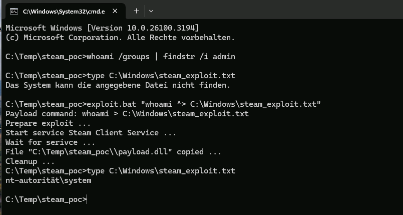

# Steam-client-LPE
Steam client 0day privilege escalation (0day at time of upload). This vulnerability was (for some reason) not deemed as privilege escalation that gains full local administrator permissions, but I let you decide this. Works with Steam client version  (newest at the time of upload).

## Exploit

1. Download repo
2. Close Steam Client if it runs (exploit messes with Steam Client Service)
3. Run exploit.bat or exploit.bat "*command*"

## Tested on
Windows 11 24H2 x64 (March 2025 Patch); Steam 9.59.29.24 with Steam Client Service 9.59.77.46

## CVSS Score
CVSS 4.0: 8.5 (CVSS:4.0/AV:L/AC:L/AT:N/PR:L/UI:N/VC:H/VI:H/VA:H/SC:N/SI:N/SA:N)
CVSS 3.1: 7.8 (CVSS:3.1/AV:L/AC:L/PR:L/UI:N/S:U/C:H/I:H/A:H)

## Vulnerability
The Steam Client Service (part of Steam Client) does a self update during startup. Files that needs to copied to the Steam Client Service application directory (C:\Program Files (x86)\Common Files\Steam) are checked if there are valid, before a copy operation is performed. But the checks and the copy operations are performed separately, giving an attacker the opportunity to replace files that will be copied to the Steam Client Service application directory. To block this the Steam Client Service opens the files to deny move and delete operations and closes the files only after the file is copied. But this can be circumvent by using Junctions and OpLocks causing a TOCTOU (Time-of-Check-Time-Of-Use) weakness, that can be abused to copy an arbitrary DLL file as SteamService.dll into the Steam Client Service application directory. The copied DLL will then be loaded by the Steam Client Service. This leads to arbitrary code execution as SYSTEM and therefore Privilege Escalation.
